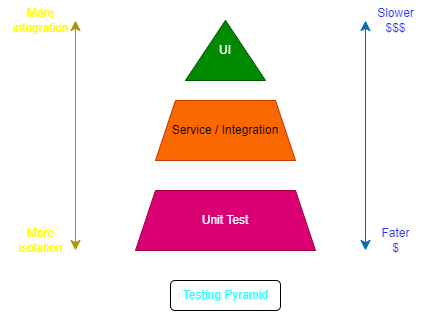
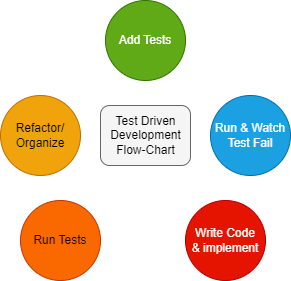
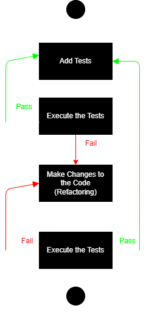

# Introduction to Testing

## Testing

--> It is the process of assessing the completeness and quality of computer software.

--> Usually this is done by running a part of a web application and comparing the actual behavior to the expected behavior.

--> There will be two methods to test the Web Application.

1. Manual Testing:
   --> It is a form of testing done by a human interacting with a system. This will be something like clicking, dragging, and typing through a webpage.

   --> While Testing if the observed behavior does not match the expected heavier, the application has an error.

   --> Errors, like the ones you may have found in the provided web app, are also called bugs. A bug is an error, fault or flaw in software that makes a system behave in unexpected ways

   --> These unexpected behaviors can cause harm to users. Ideally catches bugs before they are sent to users
   -->
   Disadvantages--:
   -->
   --> Manual testing is time-spending because running test cases in everything is done manually.

   --> Human Users (Testers) may make mistakes, so we can not expect more accuracy in Manual Testing

   --> Executing the same tests, again and again, is time taking process as well as Tedious. For every release you must rerun the same set of tests which can tiresome.

2. Automated Testing:
   --> AT is the use of software to control the execution of tests and the comparison of actual behavior to expected behavior

   --> All the testing you just did (and more) could be performed by a computer program

   --> Compared to manual testing, automated testing is:

   1. Faster
   2. More reliable
   3. Maintainable

   --> The workflow might look like this:

   - Write code and corresponding tests
   - enter a command into a terminal to run tests
   - if the app behaves as intended, all test should pass. Development is complete
   - if it does not behave as intended, at least one test should fail. Fix code and return to step 2.

## Why is Testing important?

- Testing gives you confidence in your code.
- its documentation for the developers.
- Refactoring code made easy
- Become a better developer

## Types of Tests (Front-end development perspective)

1. Unit Testing
   --> unit testing is the practice of testing small pieces of code, typically individual functions, alone and isolated.

   --> If your test uses some external resource, like the network or a database, it's not a unit test

   --> Unit tests should be fairly simple to write. A unit tests should essentially just give the function that's tested some inputs, and then check what the function outputs is correct.

   --> When should you use unit testing? Ideally all the time, by applying test-riven development

   --> A good set of unit tests do ot only prevent bugs also improve our code design, and make sure we can later refactor our code without everything completely breaking apart.

2. Integration Testing
   --> As the name suggests, in integration testing the idea is to test how parts of the system work together.

   --> It is similar to unit tests, but there is one big f=difference while unit tests are isolated from other components, integration tests are not.
   For example, a unit test for database access code would not talk to a real database, but integration test would

   --> Integration tests are often slower than unit tests because of the added complexity. They also might need some setup or configuration

   --> You should have fewer integration tests than unit tests. You should mainly use them if you need to to test two separate systems together, or if a piece of code is too complex to unit test

3. E2E Testing (Functional Testing)
   --> Function testing is also sometimes called E2E testing, or browser testing. They all refer to the same thing

   --> It is defined as the testing of complete functionality of some application

   --> In practice with web apps, this means using some tool to automate a browser, which is then used to click around in the pages to test the application

   --> You should use functional tests if you have some repeated tests you do manually in the browser

## Testing Pyramid



## Test-driven Development (TDD)

--> Software development has transitioned from a waterfall to an agile approach over the past decade. Since Agile development involves continuous change. testing became valuable

--> Most developers are familiar with test-driven development, or TDD, but behavior-driven development, or BDD is often misunderstood.

--> TDD is a software development techniques that involves writing automated test cases prior to writing functional pieces of the code.

### Process of TDD

1. A developer, based on requirement documents, writes an automated test case.

2. The development team runs these automated test scripts against what is currently developed and the test fail, as they should since none of the features have been implemented yet.

3. Development team functional code to ensure the automated test script gives them a green light.

4. The development team can then refactor and organize the code to produce a tested deliverable at the end of the script
   
   

5. Mainly TDD refers to write a test case that fails because the specified functionality does not exist and after that update the code that can make the test case pass and as a result we get the feature implement in the system

## Behavior-driven Development (BDD)

--> BDD is a software development technique that defines the user behavior prior to writing test automation scripts or the functional pieces of code.

### Process of BDD

1. The behavior of the user is defined by a product-owner/business-analyst/QA

2. These are then converted to automated scripts to run against functional code

3. The development team then starts writing the functional code to ensure the automated test script gives them a green light

4. The development team can then refactor and organize the code to produce a tested deliverable at the end of the sprint

---

1. BDD is a development technique which focuses more on a software application's behavior.

2. TDD is a development technique which focuses more on the implementation of a feature of a software application/product

3. BDD main focus is on system requirements

4. TDD main focus is on unit tests

---

## JavaScript testing tools/Features

--> A testing framework is a tool or set of tools that helps you perform unit testing

1. Test launchers:
   --> Launch a list of tests based on a configuration you provide (What browsers to run in, what babel plugins to use, how to format the output, etc).

   --> generally Test launchers are used to launch your tests in the browser or in Node.js with user config

2. Test Structures
   --> It refers to the organization of your tests. Nowadays, tests are usually organized in a BDD structure that supports BDD

   --> Testing structure providers help you to arrange your tests in a readable and scalable way

3. Assertion functions:
   --> Assertion functions are used to check if a test returns what you expect it to return and otherwise, to throw a clear exception

4. Spies
   --> Spies are attached to functions to provide extra information about them. For example, how many times a function was called. In which cases, by whom, What arguments were passed to it in each call?

5. Stubbing/ Dubbing / Function Mocking
   --> Mocking Replaces selected methods of existing modules with user-supplied functions in order to ensure expected behavior during the test

6. Generate and compare snapshots to make sure changes to data structures from previous test runs to data structure from previous test runs are intended by the user's code changes. It does not actually renders and takes a picture of the component, but it saves its internal data in a separate file

7. Generate code coverage reports of how much of your code is covered by tests

8. Browser Controllers simulate user actions for E2E Tests

9. Visual Regression Tools are used to compare your site's appearance to its previous versions visually by using image comparison techniques

## JS Testing Frameworks

### Unit Testing Frameworks:-

- Mocha
- Jest
- Jasmine
- Tape
- Qunit

### In order to test we need to have

1. testing structure
2. assertion library
3. how you want to run the tests

---

**_Unit and integration tests can run on the fly, as you code, using "watch mode" because they finish running in seconds. On the other hand E2E tests are usually launched before merges and releases. In some companies it takes hours to finish running all the E2E tests_**

**_Jest is the testing framework created and maintained by Facebook. It was initially based on Jasmine_**

**_Performance- First of all Jest is considered to be faster for big projects with many test files by implementing a clever parallel testing mechanism_**

Jest Provides

- Snapshot testing
- Mocking
- Code coverage

Jasmine is also one of the Testing Framework which supports BDD development just like jest. Has widespread Angular support for all its versions and it is recommended in the official Angular documentation

**_Karma is nothing but a test runner tool. It is the ability to run tests against real browsers and real devices, which makes your testing strategy more robust and reliable_**

### E2E Testing Frameworks:-

E2E tests control browsers and simulate user behavior in the browser (clicking, typing, scrolling etc ...) and make sure these scenarios actually work from the point of view of an end-user

Puppeteer
Playwright
Protractor
WebdriverIO
TestCafe
Cypress

## Introduction to Jasmine

### What is Unit Testing?

--> Unit Testing is testing individual units of code.
Here unit is the smallest testable part of your code. (function)

--> Why we should write Unit test for our code?
Trust changes you make on existing (already tested) code.

If you don't have unit tests every time when you change the code we need to test manually each page, each feature before you publish

Another reason is Code Quality. the code that is tested is best

Changes occur quickly. If our code is tested we can release the changes vey quickly without breaking

It documents our own code. Unit tests are the way of explaining the function what it does what are the params it has to be passed

There are many unit test frameworks available in the market. Out of them Jasmine is one of the testing framework. Now Why jasmine?

Jasmine comes out of the box with everything you need to test your code

## Spec File Naming Conventions

--> Common file name extensions we come across will be like:
_.spec.js
_.test.js

What is Suite (describe)-: It is simply a group of spec, also say it as group of tests (it)

spec is a group of expectations (expect)

Expectation is just a assertion
Assertion is just a proposition / declarative-statement (which can be either true or false)

### When we say passing spec or failing spec?

--> Spec with all expectations is passing spec. No matter we have 100 expectations, all expectations should be true.

if we have a spec with one or more false expectations then it is a failing spec

### When we write the disabled spec. there will be two cases

1. When you have changes in the code and you want to disable the spec from failing until your changes are completed

2. Another one is TDD -> Test Driven Development. We write the tests first and after that we write the code and make the tests pass

When we disable the suite?
--> all the specs within disables, suite will be marked as pending and not executed

### Matcher

A matcher is just a function and this function implements a boolean comparison between the actual value and expected value

1. toBe
2. toEqual -check the deep equality
   {key : value}
   {key : value}

   keys --> same value and also same type
   values --> same value and same type

3. toBeTruthy
4. toBeFalsy
5. not
6. toBeDefined
7. toBeNull
8. toContain
9. toBeNaN
10. toThrow
11. toThrowError
12. toMatch

### Asymmetric Matcher. When to use & what is the use of jasmine.anything

1. anything
2. any
3. ObjectContaining
4. StringContaining

### Custom Matchers

--> it is ait its root is a comparison function that takes an actual value and expected value.
--> this method should return an object with a compare function that will be called to check the expectation.

like-:

```js
const customMatcher = {
   return {
      compare: function(actual, expected){}
   }
}
```

The compare function receives the value passed to expect() as the first argument - the actual and the value (if any) passed to the matcher itself as second argument

The compare function must return a result object with a pass property that is a boolean result of the matcher.
The pass property tells the expectation whether the matcher was successful (true) or (false)

```js
const customMatcher = {
   return {
      compare: (actual, expected)=>{
         return {
            pass: true,
            message: ''
         }
      }
   }
}
```

For usi the custom Matcher we need to register the custom matchers with Jasmine.addMatchers()

Once a custom matcher is registered with Jasmine, it is available on any expectation

## Organizing Specs

1. The 1st recommendation is we need to use describe. Describe Method ( group of Specs which is called spec suite / test suite)
2. The 2nd is the naming convention. We need to create a spec file with the same name that matches the sources file we are unit testing
3. Maintain the folder structure
4. We can also organize our specs by nesting suites

## Setup and Teardown

To organize our specs more we need to know about the Setup and teardown

Setup and Teardown is a part of the life cycle for our suites
Setup is where we place pre-requisites for our specs. It executes before specs are run. jasmine offer teo methods for this.

- beforeEach-: it is executed before each spec in the suite in which it is called

- beforeAll-: it is executed before all specs in suite only once

Teardown in the life cycle of our suite is used to clean up the specs for our suite. It is executed after all spec are run

- afterEach
- afterAll

## Jasmine spies

--> jasmine is made for unit testing. Unit tests are supported to test only one component of your application

--> A Component can be a function, an object, a module, basically everything self-contained that acts a black box to the outside world.

--> we usually want to avoid that our unit tests fail because another component failed. That's why we want to test our components in isolation as mush as possible

Spies create test doubles and help us isolate dependencies for true unit testing

A test double is an object that can stand in for a real object in a test--it's just a duplicate object.

We use test double to replace the dependencies in our suite

These will create us a control environment because we are controlling the test so that we don't have any dependencies

Jasmine has test double functions called as spies. In other framework they are called test doubles.

A spy can stub any function and track calls to it and all arguments

A spy only exists in the suite (describe) or the spec (it) block in which it is defined and will be removed after each spec

That means our spy can not be shared between different describes and different specs

If we want to share some behavior with our spies we can use setup and teardown methods

There are also some special matchers for interacting with spies

- toHaveBeenCalled
- toHaveBeenCalledWith
- toHaveBeenCalledTimes

## Karma Test Runner

Karma is a test runner tool

if you run the tests in the browser karma plays a nice role for running tests

Karma starts a local web server and opens it in the browser running the tests

Karma allows us to choose the browser of our choice

Karma completely gives us the test results

Karma supports almost all the JS frameworks

## puppeteer -- headless chrome

## Angular testing

The goal of the automated testing is to increase the quality of the software

Angular has two types of unit tests

- isolated
- integration

### Types of Unit test

- Basic unit test is the Isolated tests. This is what we think of a unit test

- A unit might contain business logic that needs to be tested in isolation

There are a few Angular units that can be tested in isolation.

- Pipe
- Service
- Class
- Component
- Directives

In isolation we always should mock our dependencies, otherwise, it isn't isolation anymore

- An integration Test is a bit more complex. In Angular integration test we actually create a module that we are going to test

- Normally there are two types of integration tests-:
- shallow Test --: In Shallow Tests, we only test a single component with it's template
- Deep Test --: we test many components actually having child components. Sometimes we get a scenario to test both parent and child component. this is called as deep integration test

Sometime's we get a scenario to test both parent and child component. This is called as deep integration test.

--mocking:
Mocking is very useful when we want to test single unit of a code. Most of the time class does not operate in isolation. Most classes or components have dependencies.

types of mocks

1. Dummies
2. Stubs
3. Spies

### TestBed

TestBed is the central utility for configuring and creating Angular testing modules. It allows you to set up the testing environment by configuring providers, components, and other dependencies.
With TestBed, you can create instances of components, services, and directives within the testing module.

### ComponentFixture

ComponentFixture is a wrapper around a component that provides access to the component instance and its associated DOM element.
It is used in component testing to interact with the component, trigger change detection, and make assertions about its state and behavior.

### TestModuleMetadata

TestModuleMetadata is an interface that defines the configuration of an Angular testing module. It includes properties such as declarations, imports, providers, and schemas that allow you to specify the components, modules, services, and schemas used in the testing module.

### async and fakeAsync

Angular provides mechanisms for dealing with asynchronous operations in tests. The async function and fakeAsync zone allow you to handle asynchronous code and ensure that the testing environment is stable before making assertions.
async is used with the await keyword to handle promises, while fakeAsync is used to simulate the passage of time without waiting for real-time.

### DebugElement

DebugElement is a wrapper around a DOM element in the testing environment. It is used to query and interact with elements in the component's view.
DebugElement is commonly used in component testing to traverse the component's DOM structure and make assertions about the rendered HTML.
